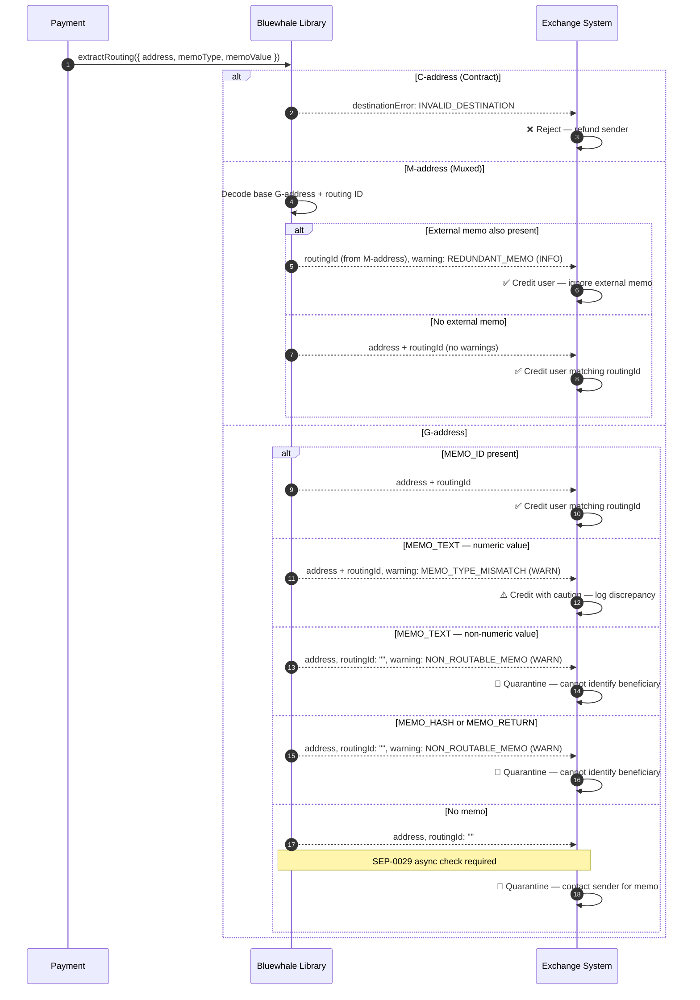

The library follows a strict set of rules to determine the `address` and `routingId` for any given input.

## Deposit Routing Flow

The diagram below illustrates the full decision tree — from payment arrival through address type detection, memo validation, and warning evaluation — ending in the exchange action recommended for each outcome.

## Routing Scenarios

<AccordionGroup>
  <Accordion title="M-Address (No Memo)">
    Input: `MA7Q...QD`
    Output:
    - `address`: `GA7Q...HB`
    - `routingId`: `123`
  </Accordion>
  <Accordion title="M-Address + External Memo">
    Input: `MA7Q...QD` + `MEMO_ID: 999`
    Output:
    - `address`: `GA7Q...HB`
    - `routingId`: `123`
    - `warning`: `REDUNDANT_MEMO` (The M-address ID takes priority).
  </Accordion>
  <Accordion title="G-Address + MEMO_ID">
    Input: `GA7Q...HB` + `MEMO_ID: 123`
    Output:
    - `address`: `GA7Q...HB`
    - `routingId`: `123`
  </Accordion>
  <Accordion title="G-Address + Numeric MEMO_TEXT">
    Input: `GA7Q...HB` + `MEMO_TEXT: "123"`
    Output:
    - `address`: `GA7Q...HB`
    - `routingId`: `123`
    - `warning`: `MEMO_TYPE_MISMATCH` (Numeric text memos are often sent by mistake instead of ID memos).
  </Accordion>
  <Accordion title="G-Address + Non-Numeric MEMO_TEXT">
    Input: `GA7Q...HB` + `MEMO_TEXT: "abc"`
    Output:
    - `address`: `GA7Q...HB`
    - `routingId`: `""`
    - `warning`: `NON_ROUTABLE_MEMO` (Cannot extract a numeric ID from text).
  </Accordion>
  <Accordion title="G-Address + MEMO_HASH/RETURN">
    Input: `GA7Q...HB` + `MEMO_HASH: "..."`
    Output:
    - `address`: `GA7Q...HB`
    - `routingId`: `""`
    - `warning`: `NON_ROUTABLE_MEMO`.
  </Accordion>
  <Accordion title="C-Address">
    Input: `C...`
    Output:
    - `address`: `""`
    - `destinationError`: `INVALID_DESTINATION`.
  </Accordion>
</AccordionGroup>

## Recommended Exchange Actions by Warning Code

| Warning Code | Severity | Recommended Action |
|---|---|---|
| _(no warning)_ | — | ✅ Auto-credit the matching user account. |
| `REDUNDANT_MEMO` | `INFO` | ✅ Auto-credit using the M-address routing ID; discard the external memo. |
| `MEMO_TYPE_MISMATCH` | `WARN` | ⚠️ Credit with caution — log the mismatch; alert your monitoring system. |
| `NON_ROUTABLE_MEMO` | `WARN` | 🔶 Quarantine — memo cannot be mapped to a routing ID; contact sender. |
| `MISSING_REQUIRED_MEMO` | `WARN` | 🔶 Quarantine — beneficiary unknown; contact sender for the missing memo. |
| `JS_PRECISION_LOSS` | `ERROR` | ❌ Reject — routing ID exceeds JavaScript safe integer range; use BigInt-safe handling. |
| `INVALID_DESTINATION` | _(error)_ | ❌ Reject — destination is a contract address or malformed; refund or discard. |
